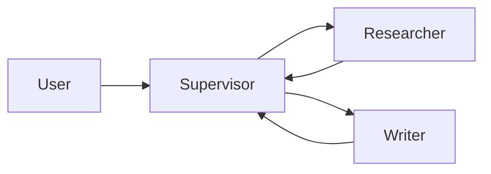

# Styling Guide

Every file in this repository follows the rules below. The rules exist to keep the repo readable, scannable, and maintainable at scale. PRs that violate the rules will be requested for changes.

The guiding principle: density over decoration. Senior readers pattern-match on signal-to-noise ratio. Emoji forests, badge walls, and ASCII box drawings signal performance, not expertise. Cut everything that is not load-bearing.

## Tables

Use tables sparingly. Only for:

- Small comparison tables (2 to 4 columns, 10 or fewer rows)
- Data that genuinely benefits from a grid layout

Prefer lists for most content. Large tables are hard to read on mobile and harder to maintain. If a table has more than 10 rows, ask whether it should be a list instead.

## Formatting

Do not use:

- Bold (`**text**`) for emphasis. Use it only for semantic markup (a term being defined, a file name in running prose where backticks do not fit).
- Italic (`*text*`) for emphasis. Use it only for titles of works or for introducing a new term the first time it appears.
- Horizontal rules (`---`) between every section. Use them only to separate top-level sections of a long document where the heading hierarchy alone is insufficient.
- ALL CAPS for emphasis.
- Emoji in headings, table-of-contents entries, or list bullets. Emoji in body prose is acceptable only when it is itself the subject (e.g., discussing emoji rendering in PDFs).

Do use:

- Backticks for filenames, code terms, commands, and API names: `StateGraph`, `add_node`, `langgraph.json`
- Backticks for inline code that is not a full code block
- Fenced code blocks with a language tag for all multi-line code: ` ```python `
- Blank lines before and after lists, code blocks, and tables

## Lists

Use blank lines before and after lists.

For simple items:

- Item one
- Item two

For numbered sequences:

1. First step
2. Second step
3. Third step

For items with descriptions, use a single dash with a space:

- Item one - description here
- Item two - description here

Use a single dash (`-`) for separators within text, not a double dash (`--`).

For grouped lists with sub-items, use proper nesting:

- Category name
  - Item one
  - Item two
- Another category
  - Item three

## Links

Links with descriptive text:

[Analysis](analysis/analyze.py) - main analysis script

For multiple links, format as a list:

- [analyze.py](analysis/analyze.py) - full statistical analysis
- [analyze_patterns.py](analysis/analyze_patterns.py) - pattern analysis

Do not use "click here" or "this link" as link text. The link text should describe what the reader will find.

## Headings

H1 (`#`) is used once at the top of each document for the title.

H2 (`##`) is used for main sections.

H3 (`###`) is used for subsections when it makes logical sense to organize content under a main section.

H4 (`####`) is used sparingly, only when a subsection needs its own subsection.

Do not skip levels. Do not use headings for emphasis. Do not put code in headings.

## Numbers and statistics

Use percentages with one decimal place for clarity:

- 69.4% instead of 69%
- 12.3% instead of 12%

Use raw counts for small numbers, add percentages for context:

- 621 jobs (69.4%)

Every statistic must have a source. Unsourced numbers are worse than no numbers. If you do not have a source, do not include the number. The repo does not quote fabricated statistics.

When citing a source, link it inline:

- MCP adoption grew 300% in Q1 2026 ([Anthropic announcement](https://www.anthropic.com/news/mcp))

## Code blocks

Every code block has a language tag:

```python
from langgraph.graph import StateGraph
```

For shell commands:

```bash
pip install langgraph
```

For output:

```text
[INFO] Agent started
[INFO] Tool call: web_search("langgraph")
```

Code blocks should be runnable as-is when possible. If a code block requires setup, link to a setup section or include the setup in the block. Do not include code that depends on variables defined elsewhere in the document without showing the definition.

## Diagrams

Prefer Mermaid in a fenced code block. Mermaid renders on GitHub, is version-controllable, and is accessible to screen readers.



Use ASCII diagrams only for tiny inline illustrations (three to five nodes). Do not use ASCII box drawings for full-page architecture diagrams.

## Voice

Write in first person ("I") for opinions and analysis:

- "I found that supervisor patterns fail when..." not "It was found that supervisor patterns fail when..."
- "My recommendation is..." not "The recommendation is..."

Write in second person ("you") for instruction:

- "You will build a ReAct agent..." not "The reader will build a ReAct agent..."

Be direct and concrete. Avoid bureaucratic language. Avoid hedging ("it might be worth considering"). If you have a recommendation, make it.

## Tone

The tone is professional, not casual. Professional does not mean formal — it means precise. Contractions are fine. Slang is not. Exclamation marks are rare and used only for genuine emphasis.

## File naming

Folders and files are kebab-case with zero-padded numbers:

- `01-foundations/`
- `02-sequential-workflows.md`
- `from-ml-engineer.md`

No spaces. No title case. No CamelCase. Numbers are zero-padded to two digits so that `ls` sorts correctly.

## Frontmatter

Every chapter file begins with a metadata block:

```markdown
# [Chapter title]

Module: 04-tools-and-mcp
Chapter: 02-mcp-from-scratch
Status: draft | beta | stable
Last reviewed: YYYY-MM-DD
Estimated time: X hours
```

This block is the contract between the reader and the maintainer. The reader uses it to decide whether the chapter is current. The maintainer uses it to track review cycles.
