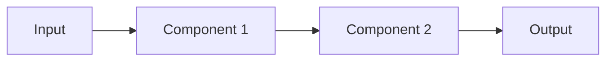

# Project NN - [Project name]

Difficulty: ⭐ to ⭐⭐⭐⭐⭐
Estimated time: X to Y weeks
Status: spec | in-progress | complete

## Problem

[Two to four sentences. The real-world problem. Who has it. Why it matters. Why it is hard.]

## Architecture

[Description of the architecture. The key components. The data flow. Why this architecture and not the alternatives.]

## Stack

- Orchestration: LangGraph 0.2.x
- Tools: [MCP servers, APIs]
- Storage: [Postgres, Redis, etc.]
- Observability: LangSmith
- Deployment: Docker / LangGraph Platform

## Eval rubric

| Metric | Target | How measured |
|--------|--------|--------------|
| [Metric] | [Target] | [Method] |
| [Metric] | [Target] | [Method] |
| [Metric] | [Target] | [Method] |

## Datasets

- [Dataset name] - [source, size, license]
- [Dataset name] - [source, size, license]

## Stretch goals

- [Stretch goal 1]
- [Stretch goal 2]
- [Stretch goal 3]

## References

- [Link to similar real-world systems]
- [Link to relevant papers]
- [Link to real job postings that ask for this skill]

## Solution

[Link to `-solutions/project-NN/` with a spoiler warning. Reference solutions are gated so that learners attempt the project before reading the answer.]
