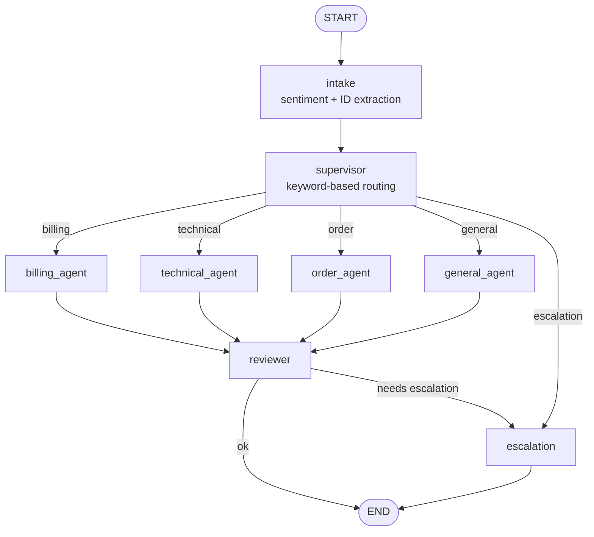

# Architecture

## Overview

This project is a **multi-agent customer support system** built with
[LangGraph](https://langchain-ai.github.io/langgraph/). A supervisor routes
each incoming message to one of four specialist agents (billing, technical,
order tracking, general), each equipped with its own tools. A lightweight
sentiment/urgency check runs before routing so upset customers - or anyone
who asks for a human - get escalated to a support ticket immediately,
rather than being cycled through a bot.

## Layered design

```
data/            static "database" (JSON) + knowledge base articles (.md)
core/            framework-agnostic business logic (pure Python + scikit-learn)
                 -> billing.py, orders.py, tickets.py, knowledge_base.py,
                    intent.py, sentiment.py
app/             LangGraph/LangChain orchestration layer built on top of core/
                 -> state.py   (shared graph state schema)
                 -> tools.py   (LangChain @tool wrappers around core/ functions)
                 -> agents.py  (node functions: supervisor, specialists, escalation)
                 -> graph.py   (wires nodes into a StateGraph, adds memory)
                 -> llm.py     (provider selection: Anthropic / OpenAI / mock)
                 -> cli.py, api.py   (two ways to talk to the graph)
streamlit_app.py chat UI (talks to the graph in-process)
```

`core/` has zero dependency on LangChain/LangGraph, which keeps the actual
business logic (data lookups, refund rules, classification, search)
independently unit-testable and reusable outside of any particular agent
framework. `app/` is a thin orchestration layer on top: it decides *when*
to call which `core/` function and how to turn the result into a reply.

## The graph



### Node responsibilities

| Node | Responsibility |
|---|---|
| `intake` | Detects sentiment/urgency (`core/sentiment.py`) and extracts any order/invoice/customer IDs mentioned (`core/intent.py`). Flags `needs_escalation` for angry customers or explicit "let me talk to a human" requests. |
| `supervisor` | Routes to a specialist using a fast keyword classifier (`core/intent.py`) - no LLM call needed for routing, which keeps it cheap, low-latency, and fully testable offline. Already-flagged escalations skip specialists entirely. |
| `billing_agent` / `technical_agent` / `order_agent` / `general_agent` | Each is a LangGraph `create_react_agent` bound to a specific tool subset (see `app/tools.py`) when an LLM is configured, or a deterministic template built directly on `core/` functions in mock mode. |
| `reviewer` | Decides whether the turn is actually resolved. If a specialist couldn't find what it needed (e.g. an order ID that doesn't exist), it routes to `escalation` instead of ending the turn. |
| `escalation` | Opens a support ticket (`core/tickets.py`) and returns a hand-off message. Terminal node. |

### Why a heuristic router instead of an LLM router?

Routing is a high-frequency, low-ambiguity decision - "does this mention an
invoice or a tracking number?" doesn't need an LLM call to answer
correctly most of the time, and a wrong route just costs one extra hop
through `reviewer`/`escalation` rather than a wrong answer to the
customer. Keeping it heuristic means: no added latency, no added cost, and
the routing logic is unit-testable with plain `assert` statements (see
`tests/test_core_intent_sentiment.py`) instead of needing an LLM mock.

The specialist agents, where free-form reasoning and tool use actually
matter, are where the LLM (when configured) does the real work.

## Memory / multi-turn conversations

The graph is compiled with a `MemorySaver` checkpointer
(`langgraph.checkpoint.memory.MemorySaver`), keyed by `thread_id`. That
means:

- Each conversation only needs to send its newest message per turn - not
  the full history.
- Fields like `customer_id` (extracted once) persist across turns without
  the caller re-sending them.
- Swap `MemorySaver` for a persistent checkpointer (Postgres, SQLite, Redis)
  in `app/graph.py` for production use - conversations currently only live
  in the process's memory and are lost on restart.

## Mock mode vs. live LLM mode

Every specialist agent checks `app.llm.get_llm()`. If it returns `None`
(no `ANTHROPIC_API_KEY` / `OPENAI_API_KEY` configured), the node falls back
to a deterministic response built directly from the same `core/` functions
a real tool-calling agent would use. This means:

- The entire graph - routing, tool use, escalation, multi-turn memory - runs
  and is testable with **zero API keys and zero cost**.
- Adding a key in `.env` upgrades every specialist to a real, natural-
  language, tool-calling LangGraph agent (`create_react_agent`) without
  changing anything else about the graph's shape.

## Extending this project

- **New specialist**: add a `core/` module for its business logic, wrap it
  as tools in `app/tools.py`, add a node + prompt in `app/agents.py`, wire
  it into `app/graph.py`'s conditional edges, and add a keyword bucket in
  `core/intent.py`.
- **Real database**: replace `core/db.py`'s JSON-file backend with a real
  DB client - nothing above it needs to change.
- **Real vector search**: swap `core/knowledge_base.py`'s TF-IDF index for
  an embeddings-based store (Chroma/FAISS/pgvector) behind the same
  `search_kb(query, k)` interface.
- **Human-in-the-loop approval**: LangGraph supports interrupting a graph
  run before a sensitive tool call (e.g. `issue_refund`) for human
  approval - see LangGraph's `interrupt_before` docs.
