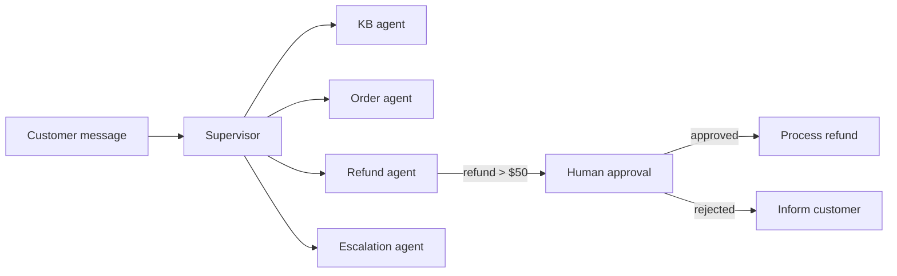

# Project 02 - Customer support multi-agent

Difficulty: ⭐⭐⭐
Estimated time: 2-3 weeks
Status: spec

## Problem

Route customer messages to the right specialist, resolve or escalate to human, log everything for QA. The agent must handle order issues, refunds, bug reports, and feature requests, with human escalation for high-value refunds and ambiguous cases.

This project exercises the supervisor pattern, the HITL pattern (approval for refunds over $50), persistence (conversation history across sessions), and observability (every tool call logged). It is the canonical "production-shaped" project.

## Architecture

A LangGraph supervisor routes to four specialists:

1. Knowledge base agent (RAG over support docs).
2. Order status agent (tool calls to order API).
3. Refund agent (tool calls to refund API, requires HITL approval for amounts over $50).
4. Escalation agent (hands off to a human via Slack or Zendesk).

The supervisor sees the message, classifies the intent, routes to the right specialist, and either returns the response or escalates. The refund agent interrupts for human approval on high-value refunds.

## Stack

- Orchestration: LangGraph 0.2.x with `langgraph-supervisor`
- Tools: MCP servers (order API, refund API, KB search)
- Persistence: Postgres checkpointer
- HITL: `interrupt()` and `Command(resume=...)`
- Observability: LangSmith
- Escalation: Slack API or Zendesk API
- Deployment: Docker or LangGraph Platform

## Eval rubric

| Metric | Target | How measured |
|--------|--------|--------------|
| Routing accuracy | 95%+ | Golden dataset of 30 messages with labeled intents |
| Resolution rate | 70%+ | Percentage resolved without human escalation |
| CSAT | 4.0+ on 5 | Post-resolution survey |
| Tool-call correctness | 95%+ | Trajectory eval: right tool, right args |
| HITL approval latency | under 5 minutes | Wall-clock from interrupt to resume |

## Datasets

- 30 customer messages with labeled intents and expected routes
- 10 high-value refund scenarios requiring HITL approval
- A mock order/refund API for testing

## Stretch goals

- Learn from escalations (every human escalation becomes a training case for the router)
- Multi-language support
- Proactive outreach (agent messages customer about order delays before customer complains)

## References

- [Klarna's AI assistant](https://www.klarna.com/international/press/klarna-ai-assistant-handles-two-thirds-of-customer-service-chats-in-its-first-month/) - production reference
- Real job postings: search "AI engineer" + "customer support" on builtin.com

## Solution

Reference solution: [projects/-solutions/02-customer-support-multi-agent/](https://github.com/DevTeam/autonomous-agent-framework/tree/main/projects/-solutions/02-customer-support-multi-agent) (coming soon). Build your own first.
