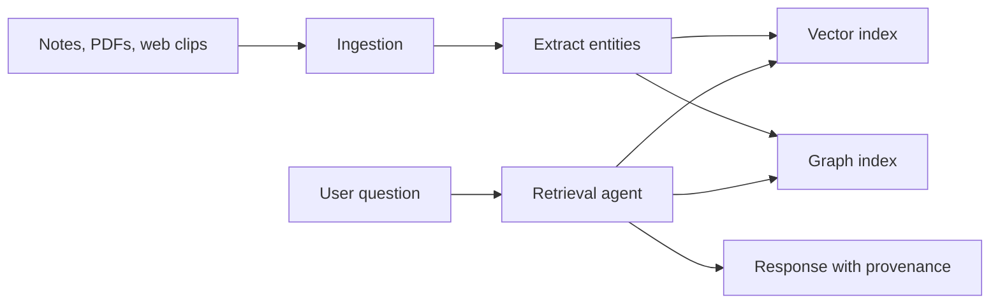

# Project 03 - Personal knowledge manager

Difficulty: ⭐⭐⭐
Estimated time: 2-3 weeks
Status: spec

## Problem

A user wants to dump notes, web clips, and PDFs into a system and have it surface the right thing at the right time, organized by concept (not by date or filename). The system must ingest heterogeneous inputs, extract entities and relationships, and answer questions with provenance (every claim links to a source).

This project exercises RAG (retrieval over the knowledge base), graph memory (entities and relationships), the LangGraph Store (long-term memory), and multi-modal ingestion (text, PDFs, web pages). It is the canonical "memory" project.

## Architecture

1. Ingestion pipeline: file watchers, web clipper, email forwarder. Extracts text from PDFs, HTML, markdown.
2. Extraction: layout-aware parsing, entity extraction (people, places, concepts), relationship extraction.
3. Indexing: embeddings for vector search; entities and relationships into a graph store.
4. Retrieval agent: LangGraph with both vector search (find relevant chunks) and graph traversal (find related entities).
5. Response with provenance: every claim in the response links to a source document.

## Stack

- Orchestration: LangGraph 0.2.x
- Ingestion: LlamaIndex or Unstructured
- Storage: Postgres + pgvector (vector), Apache AGE or Neo4j (graph)
- MCP: retrieval tool server
- LLM: GPT-4o or Claude Sonnet
- Observability: LangSmith

## Eval rubric

| Metric | Target | How measured |
|--------|--------|--------------|
| Retrieval precision@5 | 80%+ | LLM-as-judge: relevance of returned chunks |
| Entity extraction F1 | 85%+ | Hand-labeled 100-document set |
| Provenance accuracy | 100% | Every claim links to a source |
| Indexing latency | under 30s per doc | Wall-clock |
| Query latency p95 | under 5s | Wall-clock |

## Datasets

- 50 documents (mix of PDFs, markdown, HTML)
- Hand-labeled entities and relationships for 20 documents
- 30 questions with expected answer sources

## Stretch goals

- Zettelkasten-style note linking (suggest links between notes)
- Temporal reasoning (answer "what did I think about X last month?")
- Multi-user with per-user graphs

## References

- [Obsidian](https://obsidian.md/) - the canonical reference for personal knowledge management
- [Notion AI](https://www.notion.so/product/ai) - production reference
- Real job postings: search "AI engineer" + "RAG" + "knowledge" on builtin.com

## Solution

Reference solution: [projects/-solutions/03-knowledge-manager/](https://github.com/DevTeam/autonomous-agent-framework/tree/main/projects/-solutions/03-knowledge-manager) (coming soon). Build your own first.
