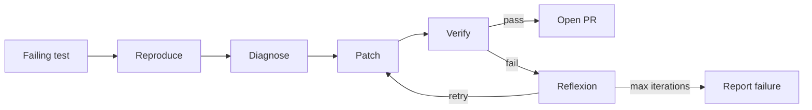

# Project 04 - Self-healing code agent

Difficulty: ⭐⭐⭐⭐
Estimated time: 3-4 weeks
Status: spec

## Problem

Given a failing test in a Python repo, produce a patch that makes the test pass without breaking other tests. The agent must reproduce the failure, diagnose the cause, write a patch, verify it, and iterate (with reflexion) until the test passes or a max-iteration limit is hit.

This project exercises plan-and-execute, reflexion, tool calling (git, pytest, file I/O), and trajectory evals. It is the canonical "autonomous SDLC" project at a portfolio-relevant scope.

## Architecture

1. Reproduce: run the failing test, capture the traceback.
2. Diagnose: an LLM reads the traceback and the relevant code, produces a diagnosis.
3. Patch: an LLM writes a diff that addresses the diagnosis.
4. Verify: run the test suite. If the failing test passes and no other tests break, done. Otherwise, reflexion: critique the patch, retry.
5. Submit: open a PR with the patch.

## Stack

- Orchestration: LangGraph 0.2.x with plan-and-execute + reflexion
- Tools: git, pytest, file read/write (as MCP servers or native tools)
- LLM: Claude Sonnet or GPT-4o (strong code models)
- Observability: LangSmith (trajectory evals are critical)
- PR creation: GitHub API

## Eval rubric

| Metric | Target | How measured |
|--------|--------|--------------|
| Pass rate | 40%+ | Held-out set of 50 failing tests |
| No-regression rate | 95%+ | Merged patches do not break other tests |
| Cost per patch | under $1 | Sum of LLM call costs |
| Trajectory efficiency | median under 8 LLM calls | Per-patch LLM call count |

## Datasets

- 50 failing tests from real open-source Python repos (the SWE-bench-lite dataset is a good source)
- Hand-verified patches for evaluation

## Stretch goals

- Handle multi-file patches
- Handle test failures that require environment changes (not just code)
- Learn from past patches (build a retrieval index of past fixes)

## References

- [SWE-agent](https://github.com/princeton-nlp/SWE-agent) - the academic reference
- [SWE-bench](https://www.swebench.com/) - the benchmark
- [Cursor's agent](https://cursor.com/blog) - production reference
- Real job postings: search "AI engineer" + "code agent" on builtin.com

## Solution

Reference solution: [projects/-solutions/04-self-healing-code-agent/](https://github.com/DevTeam/autonomous-agent-framework/tree/main/projects/-solutions/04-self-healing-code-agent) (coming soon). Build your own first.
