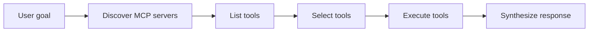

# Project 05 - MCP universal agent

Difficulty: ⭐⭐⭐⭐
Estimated time: 3-4 weeks
Status: spec

## Problem

Given a dynamically discovered set of MCP servers, the agent should accomplish a user goal by composing tools from those servers, with no prior knowledge of the tools. The key challenge is tool-selection accuracy when the tool list is large and dynamic.

This project exercises dynamic tool loading, tool discovery, and the tool-design principles from module 04. It is the canonical "MCP" project.

## Architecture

1. Discovery: the agent queries a local MCP registry (a JSON file) to find available servers.
2. Tool listing: the agent connects to each server and lists its tools.
3. Tool selection: an LLM call picks the right tool(s) for the user's goal from the discovered list.
4. Execution: the agent calls the selected tool(s) and observes the results.
5. Response: the agent synthesizes a response from the tool results.

The challenge is step 3: when the tool list has 20+ tools from 5+ servers, selection accuracy degrades. The project explores mitigations: tool categorization (group tools by domain, select category first), tool descriptions tuned for selection, and retrieval-based tool selection (embed tool descriptions, retrieve the most relevant ones).

## Stack

- Orchestration: LangGraph 0.2.x
- Tools: 5+ MCP servers (filesystem, web search, SQLite, calculator, custom)
- Registry: a JSON file listing available servers
- LLM: GPT-4o or Claude Sonnet
- Observability: LangSmith

## Eval rubric

| Metric | Target | How measured |
|--------|--------|--------------|
| Tool-selection accuracy | 85%+ | LLM-as-judge on 30 goals |
| Task completion | 75%+ | Goals completed successfully |
| Tool-argument correctness | 90%+ | Trajectory eval |
| Robustness to tool failure | 70%+ | Goals completed when one tool fails |

## Datasets

- 30 user goals that require composing tools from multiple servers
- Hand-labeled expected tool sequences

## Stretch goals

- Handle tool conflicts (two tools can do the same thing, pick the better one)
- Handle tool versioning (different versions of the same tool)
- Learn tool preferences per user

## References

- [MCP servers registry](https://github.com/modelcontextprotocol/servers) - pre-built MCP servers
- Real job postings: search "AI engineer" + "MCP" on builtin.com

## Solution

Reference solution: [projects/-solutions/05-mcp-universal-agent/](https://github.com/DevTeam/autonomous-agent-framework/tree/main/projects/-solutions/05-mcp-universal-agent) (coming soon). Build your own first.
