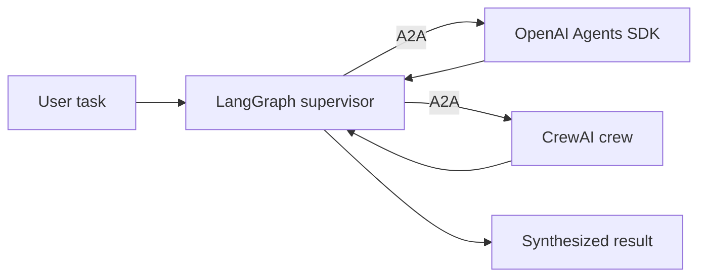

# Project 08 - Cross-framework agent network

Difficulty: ⭐⭐⭐⭐⭐
Estimated time: 4-6 weeks
Status: spec

## Problem

Three agents built on three different frameworks (LangGraph, OpenAI Agents SDK, CrewAI) need to collaborate on a single task. Demonstrate that A2A makes this work, with measurable interop overhead.

This project exercises A2A end-to-end: exposing agents as A2A servers, consuming them from other frameworks, and measuring the interop cost. It is the canonical "A2A" project.

## Architecture

A LangGraph supervisor consumes two A2A agents:

1. An OpenAI Agents SDK agent (exposed via A2A) that handles research.
2. A CrewAI crew (exposed via A2A) that handles writing.

The supervisor decomposes the task, delegates to the right agent, and synthesizes the result. The interop is at the A2A protocol level; each agent runs in its own process, possibly in its own container.

## Stack

- Orchestration: LangGraph 0.2.x (supervisor)
- A2A servers: OpenAI Agents SDK (with `a2a-openai` adapter), CrewAI (with `a2a-crewai` adapter)
- A2A client: `langchain-mcp-adapters` (which also handles A2A)
- LLM: GPT-4o or Claude Sonnet
- Observability: LangSmith (tracing across A2A boundaries)

## Eval rubric

| Metric | Target | How measured |
|--------|--------|--------------|
| Task completion | 80%+ | Tasks completed successfully |
| Interop correctness | 100% | All agent-to-agent messages conform to A2A spec |
| Latency overhead | under 2s per handoff | A2A handoff latency |
| Cost overhead | under 10% of total cost | A2A vs. native framework call |

## Datasets

- 20 multi-step tasks requiring both research and writing
- Hand-labeled expected decomposition (which agent handles which step)

## Stretch goals

- Dynamic agent discovery (find agents via an A2A registry at runtime)
- Agent failover (if one agent is down, route to a backup)
- Agent versioning (consume v1 and v2 of the same agent)

## References

- [A2A protocol](https://google.github.io/A2A/)
- [OpenAI Agents SDK](https://github.com/openai/openai-agents-python)
- [CrewAI](https://github.com/crewAIInc/crewAI)
- Real job postings: search "AI engineer" + "multi-agent" or "A2A" on builtin.com

## Solution

Reference solution: [projects/-solutions/08-cross-framework-network/](https://github.com/DevTeam/autonomous-agent-framework/tree/main/projects/-solutions/08-cross-framework-network) (coming soon). Build your own first.
